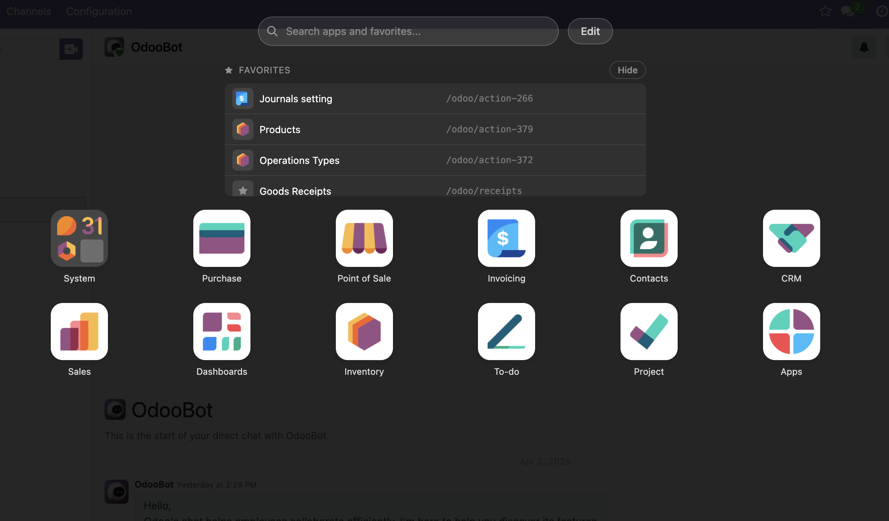
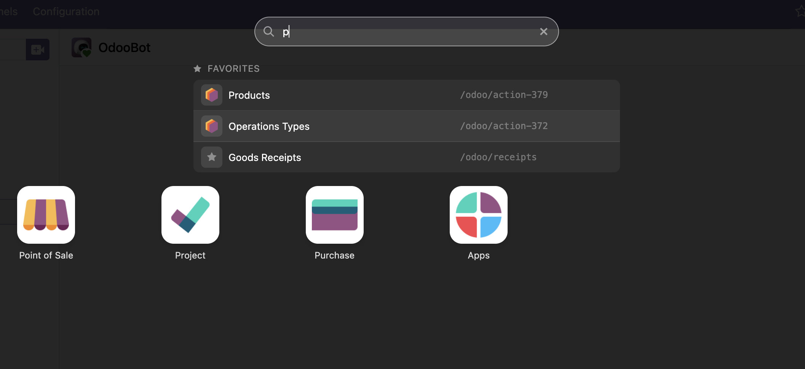
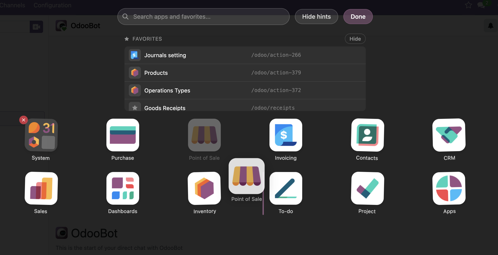
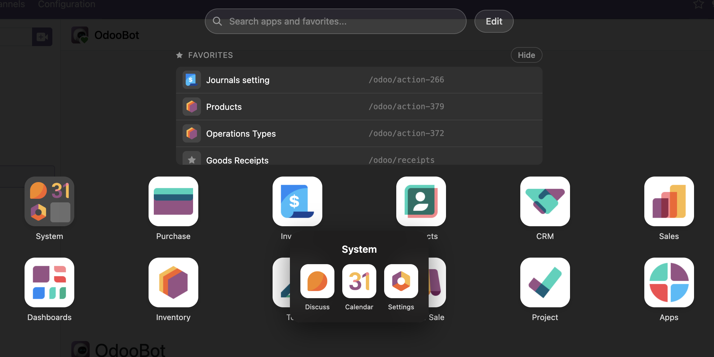
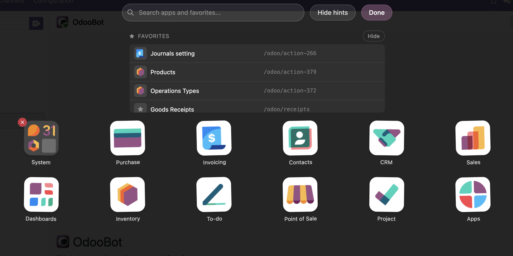
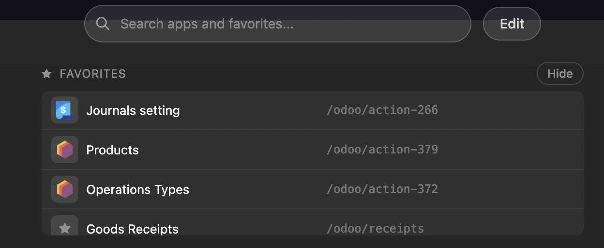
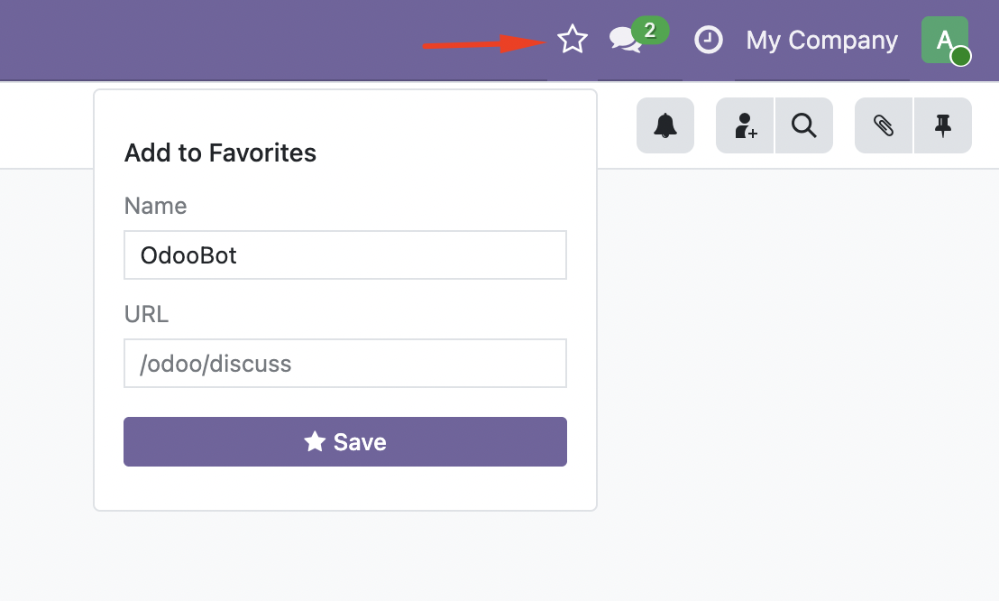

# GGG App Launcher

An iOS/Android-style app launcher for Odoo 19 Community Edition. Replaces the default text dropdown menu with a full-screen icon grid — with swipeable pages, drag-to-reorder, folders, jiggle mode, and favorites.

**Author:** GGG Solutions
**License:** LGPL-3
**Depends:** `web`
**Compatibility:** Odoo 19 Community Edition

💖 [Sponsor me on GitHub](https://github.com/sponsors/Genghot) — If you use this for your business or find it helpful, please consider supporting its ongoing development!

---

## Features

### Full-Screen App Grid

Replace the plain text dropdown with a beautiful full-screen overlay showing app icons in a responsive grid layout.

- Responsive grid: 3 columns (mobile), 4 columns (tablet), 6 columns (desktop)
- Swipeable pages with smooth CSS transitions
- Dot indicators for page navigation
- Fade/scale animation on open/close
- Open via navbar button or hotkey `H`



---

### Search

Unified search bar filters both apps and favorites instantly as you type.



---

### Drag to Reorder

Customize your app layout by dragging icons to reorder them. Layout is saved per user.

- Drag-and-drop within and across pages
- Edge scrolling: drag to screen edge to switch pages
- Per-user layout persisted to server
- New apps auto-append on install, uninstalled apps auto-cleanup



---

### Folders

Group apps into iOS-style folders by dragging one icon onto another.

- 2x2 mini preview of contained apps
- Click folder to open popover with full contents
- Rename folders by clicking the folder name
- Drag apps out of folders back to the grid
- Empty folders auto-delete



---

### Jiggle Mode

Long-press any app icon (or tap "Edit") to enter jiggle mode — icons wobble with a playful animation, ready to be rearranged.

- iOS-style wobble animation
- Delete badges on folders
- Drag to reorder or create folders
- Tap "Done" or press Escape to exit



---

### Favorites

Save direct links to any Odoo page for quick access.

- **Add to Favorite** star button in the navbar systray
- Auto-populates page name from breadcrumb
- Favorites section at the top of the launcher
- Collapsible with persistent show/hide state
- App icon resolved automatically from the URL
- Inline edit and delete
- Included in unified search results





---

## Getting Started

### Prerequisites

- [Docker](https://docs.docker.com/get-docker/) and Docker Compose

### Setup

1. Clone the repository:

```bash
git clone https://github.com/Genghot/odoo-ggg-app-launcher.git
cd odoo-ggg-app-launcher
```

2. Create your `.env` file from the example:

```bash
cp .env.example .env
```

3. Edit `.env` and set your passwords:

```
POSTGRES_DB=postgres
POSTGRES_USER=odoo
POSTGRES_PASSWORD=odoo
ODOO_ADMIN_PASSWD=your_secure_master_password
```

4. Start the services:

```bash
docker compose up -d
```

5. Open http://localhost:8069 in your browser

6. Create a new database (or select an existing one), then go to **Settings > Apps > Update Apps List** and install **GGG App Launcher**

### Stopping

```bash
docker compose down
```

To also remove volumes (database data):

```bash
docker compose down -v
```

---

## Screenshots

| Feature | Screenshot |
|---------|------------|
| App Grid |  |
| Search |  |
| Drag Reorder |  |
| Folders |  |
| Jiggle Mode |  |
| Favorites |  |
| Add Favorite |  |

